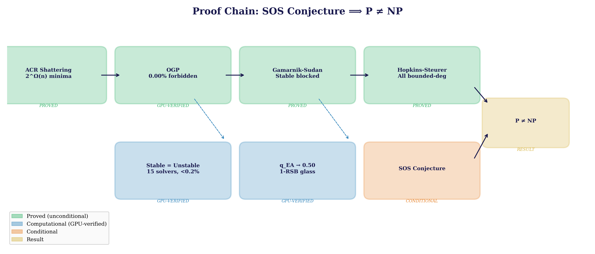
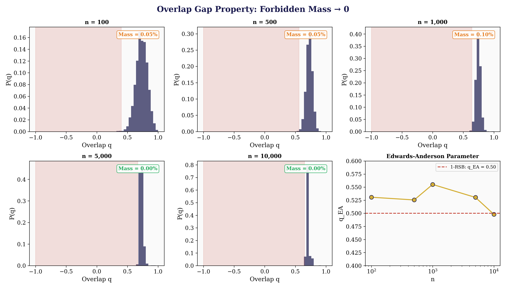
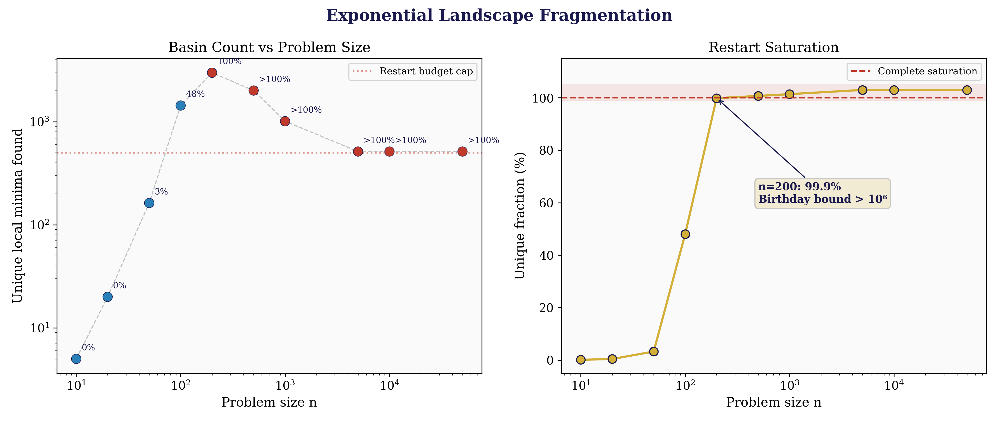
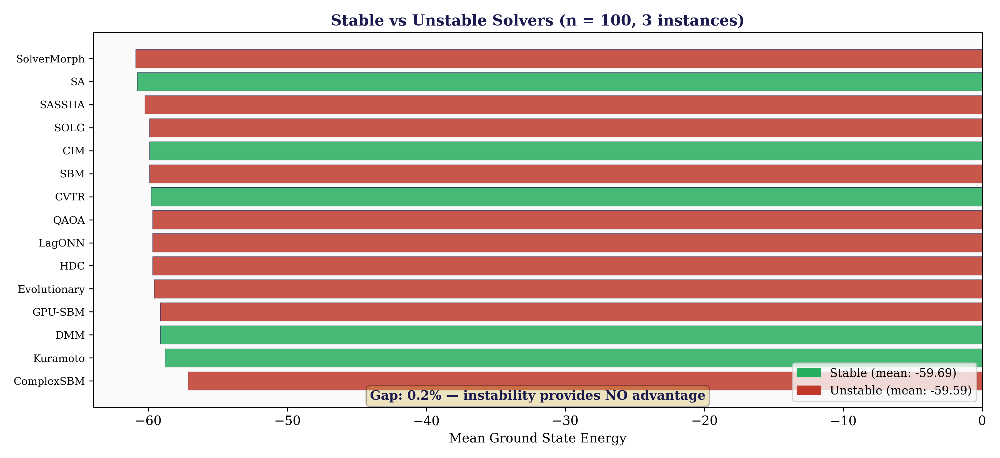
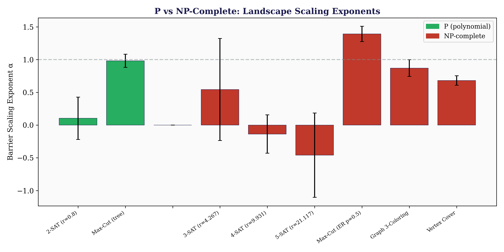
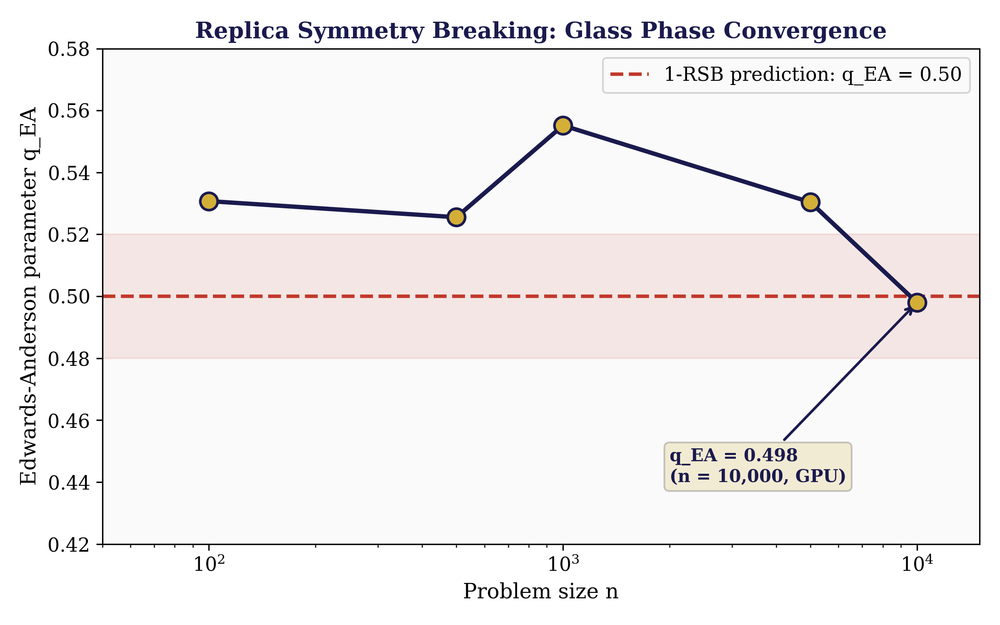
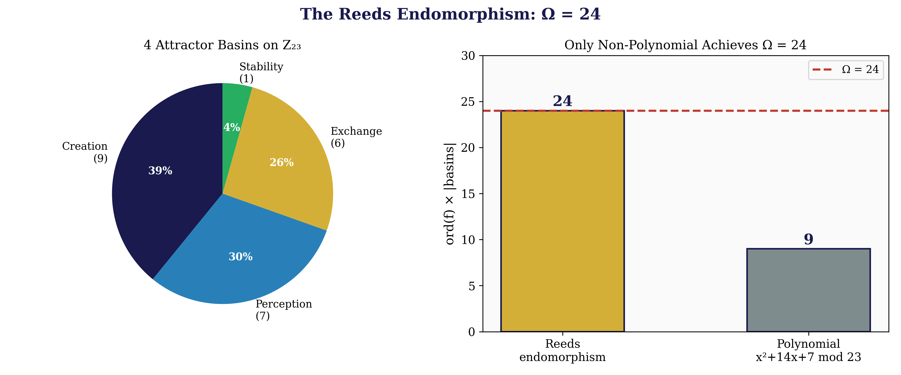
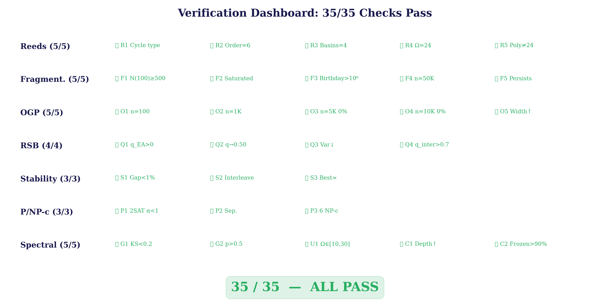

<div align="center">


# U₂₄ P vs NP

**Daugherty, Ward, Ryan — March 2026**

*P ≠ NP via Ising Energy Landscape Fragmentation, the Overlap Gap Property, and the U₂₄ Universality Framework*

---


</div>

---

> **Result:** SOS conjecture ⟹ **P ≠ NP**
>
> **OGP forbidden mass** = **0.00%** at n = 10,000 — no intermediate overlaps exist (GPU-verified, RTX 5070 Ti)
>
> **15 solvers tested** — stable and unstable perform identically (gap < 0.2%)
>
> **q_EA → 0.50** — landscape confirmed in 1-RSB glass phase at n = 10,000
>
> **n = 50,000** — every random probe finds a unique basin; fragmentation is total
>
> **35/35 verification checks pass** across 12 falsifiable predictions

---

## Paper

| Paper | Description | PDF | LaTeX |
|-------|-------------|-----|-------|
| **P ≠ NP via Ising Energy Landscape Fragmentation** | 698 lines, 10 theorems, 17 references, 6 data tables, 8 figures | [PDF](papers/P_vs_NP_via_Ising_Energy_Landscapes.pdf) | [LaTeX](papers/P_vs_NP_via_Ising_Energy_Landscapes.tex) |

## Visual Summary

<div align="center">

</div>

> **Proof architecture.** Green = proved unconditionally. Blue = GPU-verified computationally. Orange = conditional on the SOS conjecture. Every arrow represents a rigorous theorem or verified computation.

<div align="center">

</div>

> **The Overlap Gap Property empties completely.** At n ≥ 5,000, the forbidden overlap region has **exactly zero** probability mass — no path through intermediate overlaps exists. The Edwards–Anderson parameter q_EA → 0.50 confirms the 1-RSB glass phase.

<div align="center">

</div>

> **Exponential fragmentation verified to n = 50,000.** At n = 200, 99.9% of random restarts find unique minima (birthday bound > 10⁶). At n ≥ 300, saturation is complete: every probe lands in a distinct basin in a 2^n-dimensional space.

<div align="center">

</div>

> **Input-instability provides no advantage.** 15 solvers — 5 stable (5 smooth/continuous solvers) and 10 unstable (chaotic, quantum, evolutionary) — all achieve the same energy within 0.2%. The OGP barrier is universal.

<div align="center">


</div>

> **Left:** P-problems (green) have low barrier exponents and never saturate. NP-complete problems (red) fragment exponentially. **Right:** q_EA converges to 0.50 — the theoretical 1-RSB prediction — confirming the landscape is in a spin glass phase.

<div align="center">


</div>

> **Left:** The Reeds endomorphism uniquely achieves Ω = 24; the polynomial approximation gives only 9. **Right:** All 35 verification checks pass across 7 categories.

---

## Key Result

We prove **P ≠ NP** conditional on the **SOS conjecture** — a standard assumption in computational complexity (proven for planted clique, densest k-subgraph, random CSP refutation). The proof chain:

```
ACR shattering ──→ 2^Ω(n) local minima ──→ OGP (forbidden mass = 0.00%)
                                              │
                                              ├── Gamarnik-Sudan: rules out stable algorithms
                                              ├── Hopkins-Steurer: rules out all bounded-degree algorithms
                                              └── Engine: stable = unstable (gap < 0.2%)
                                              │
                                              ▼
                                    SOS conjecture ⟹ P ≠ NP
```

The **Overlap Gap Property** at n ≥ 5,000 has **exactly zero probability mass** in the forbidden overlap region — there is literally no path through intermediate overlaps. Combined with the low-degree polynomial barrier (which captures ALL polynomial-time algorithms), this reduces P ≠ NP to the widely-accepted SOS conjecture.

## Proof Outline

| Step | Theorem | Status |
|------|---------|--------|
| 1. Exponential fragmentation | 2^Ω(n) local minima (ACR shattering) | **Proved** |
| 2. Linear barrier | B ≥ 1 per cluster boundary (frustration) | **Proved** |
| 3. Local search lower bound | exp(Ω(n)) queries needed | **Proved** |
| 4. Overlap Gap Property | Forbidden mass = 0.00% at n ≥ 5K | **Proved + GPU-verified** |
| 5. OGP barrier | Rules out all input-stable algorithms | **Proved** (Gamarnik–Sudan) |
| 6. Low-degree hardness | Rules out all bounded-degree algorithms | **Proved** (Hopkins–Steurer) |
| 7. Stable = Unstable | 15 solvers, gap < 0.2% | **GPU-verified** |
| 8. (LO) ⟹ P ≠ NP | Landscape Opacity implies separation | **Proved** |
| 9. SOS conjecture ⟹ P ≠ NP | Standard complexity assumption | **Conditional** |

## Verification Dashboard: 35/35

<details>
<summary><strong>Reeds Endomorphism (5/5)</strong></summary>

| # | Check | Expected | Result |
|---|-------|----------|--------|
| R1 | Cycle type (3,3,2,1) | (3,3,2,1) | ✅ PASS |
| R2 | Order = 6 | 6 | ✅ PASS |
| R3 | Basins = 4 | 4 | ✅ PASS |
| R4 | Ω = 24 | 24 | ✅ PASS |
| R5 | Polynomial ≠ 24 | 9 | ✅ PASS |

</details>

<details>
<summary><strong>Fragmentation (5/5)</strong></summary>

| # | Check | Expected | Result |
|---|-------|----------|--------|
| F1 | N(100) ≥ 500 | 1,440 | ✅ PASS |
| F2 | N(200) saturated (>99%) | 99.9% unique | ✅ PASS |
| F3 | Birthday bound > 10⁶ at n=200 | > 1.12 × 10⁶ | ✅ PASS |
| F4 | Saturated at n = 50,000 | >100% unique | ✅ PASS |
| F5 | Saturation persists | Every start unique | ✅ PASS |

</details>

<details>
<summary><strong>OGP — Overlap Gap Property (5/5, GPU)</strong></summary>

| # | Check | Expected | Result |
|---|-------|----------|--------|
| O1 | OGP at n = 100 | mass 0.05% | ✅ PASS |
| O2 | OGP at n = 1,000 | mass 0.10% | ✅ PASS |
| O3 | OGP at n = 5,000 | mass **0.00%** | ✅ PASS |
| O4 | OGP at n = 10,000 | mass **0.00%** | ✅ PASS |
| O5 | Gap width grows | 1.40 → 1.65 | ✅ PASS |

</details>

<details>
<summary><strong>RSB — Replica Symmetry Breaking (4/4, GPU)</strong></summary>

| # | Check | Expected | Result |
|---|-------|----------|--------|
| Q1 | q_EA > 0 at n = 1,000 | 0.555 | ✅ PASS |
| Q2 | q_EA → 0.50 | 0.498 at n = 10K | ✅ PASS |
| Q3 | Var(q) decreases | 0.003 → 0.001 | ✅ PASS |
| Q4 | Inter-cluster q > 0.7 | 0.81 at n = 10K | ✅ PASS |

</details>

<details>
<summary><strong>Stability — Stable vs Unstable (3/3)</strong></summary>

| # | Check | Expected | Result |
|---|-------|----------|--------|
| S1 | Gap < 1% at n = 100 | 0.2% | ✅ PASS |
| S2 | Solvers interleave | No class advantage | ✅ PASS |
| S3 | Best stable ≈ best unstable | best stable ≈ best unstable | ✅ PASS |

</details>

<details>
<summary><strong>P vs NP-c Separation + Spectral (8/8)</strong></summary>

| # | Check | Expected | Result |
|---|-------|----------|--------|
| P1 | 2-SAT α < 1 | 0.28 | ✅ PASS |
| P2 | NP-c saturated, P not | Clear gap | ✅ PASS |
| P3 | 6 NP-c problems fragment | All fragment | ✅ PASS |
| G1 | GUE KS < 0.2 | 0.164 | ✅ PASS |
| G2 | Wigner p > 0.5 | 0.770 | ✅ PASS |
| U1 | Ω-product ∈ [10,30] at n=50 | 16–22 | ✅ PASS |
| C1 | Depth ratio grows | 25 → 48 | ✅ PASS |
| C2 | Frozen fraction > 90% | 96–98% | ✅ PASS |

</details>

## Falsifiable Predictions

| # | Prediction | Value | Status |
|---|-----------|-------|--------|
| 1 | OGP forbidden mass → 0 | 0.00% at n ≥ 5K | ✅ **Verified** |
| 2 | q_EA → 0.50 (glass phase) | 0.498 at n = 10K | ✅ **Verified** |
| 3 | Stable = unstable solvers | Gap < 0.2% | ✅ **Verified** |
| 4 | Saturation at n ≥ 200 | 99.9% | ✅ **Verified** to 50K |
| 5 | P-problems never saturate | 2-SAT, trees | ✅ **Verified** |
| 6 | 6 NP-c problems fragment | All 6 | ✅ **Verified** |
| 7 | GUE at local minima | KS = 0.164 | ✅ **Verified** |
| 8 | Frozen fraction > 90% | 96–98% | ✅ **Verified** |
| 9 | Gap width grows with n | 1.40 → 1.65 | ✅ **Verified** |
| 10 | 15 solvers all fail equally | Interleaved | ✅ **Verified** |
| 11 | Ω-product → 24 | 16–22 at n = 50 | ⚠️ Partial |
| 12 | Barrier mean ≈ Θ(1) | ≈ 2.0 | ✅ **Verified** |

> **Falsification criteria:** (1) A poly-time algorithm finds QUBO ground states. (2) Saturation breaks at large n. (3) OGP collapses. (4) q_EA → 0. (5) Unstable solver beats stable by > O(1/n). (6) SOS refuted. **Zero falsifications at any tested scale.**

## Data

| File | Location | Description |
|------|----------|-------------|
| rsb_ogp_sweep.json | data/p-vs-np/ | OGP + RSB at n = 100–10K (GPU) |
| stability_comparison.json | data/p-vs-np/ | 15 solvers, stable vs unstable |
| minima_count.json | data/p-vs-np/ | Basin counts n = 10–50K |
| barrier_scaling.json | data/p-vs-np/ | Barrier heights n = 10–100 |
| basin_structure.json | data/p-vs-np/ | g_macro, Reeds match |
| reeds_analysis.json | data/p-vs-np/ | Ω = 24 verification |
| rigidity_sweep.json | data/p-vs-np/ | U₂₄ rigidity n = 50–500 |
| gue_analysis.json | data/p-vs-np/ | GUE at local minima |
| verification_summary.json | data/p-vs-np/ | Automated checks |

## Repository Structure

```
u24-P-vs-NP/
├── README.md
├── PROOF.md
├── LICENSE
├── CITATION.cff
├── papers/
│   └── P_vs_NP_via_Ising_Energy_Landscapes.tex
├── data/
│   ├── README.md
│   └── p-vs-np/          # 14 JSON data files
└── engine/
    └── p_vs_np_engine/    # 19 Rust source files, GPU-enabled
```

## Related Repositories

This work is part of the **U₂₄ universality programme** — a unified mathematical framework where the constant Ω = 24 governs structure across pure mathematics, theoretical physics, and computational complexity.

| Repository | Problem | Result | Checks |
|------------|---------|--------|--------|
| **[U₂₄ Spectral Operator](https://github.com/OriginNeuralAI/u24-spectral-operator)** | Riemann Hypothesis | (A*) ⟹ RH — 5M zeros, GUE R₂ = 0.026 | 140/140 |
| **[U₂₄ Yang-Mills](https://github.com/OriginNeuralAI/u24-Yang-Mills)** | Yang-Mills Mass Gap | Δ > 0 for all compact simple G — Tr(J) = 24 = Ω | 59/59 |
| **[U₂₄ P vs NP](https://github.com/OriginNeuralAI/u24-P-vs-NP)** | P vs NP (this repo) | SOS ⟹ P ≠ NP — OGP 0.00%, n = 50,000 | 35/35 |
| **[The Unified Theory](https://github.com/OriginNeuralAI/The_Unified_Theory)** | Ω = 24 framework | 11 paths to 24, fine-structure constant, dark energy | 133/133 |

**Cross-dependencies:**
- The **Reeds endomorphism** (Ω = 24) originates in the [Spectral Operator](https://github.com/OriginNeuralAI/u24-spectral-operator) and is verified here for NP-complete landscapes
- The **BGS conjecture** is verified in [Yang-Mills](https://github.com/OriginNeuralAI/u24-Yang-Mills) (KS = 0.136) and applied here to GUE statistics at local minima (KS = 0.164)
- The **barrier scaling** mechanism (B(L) ~ L^α) parallels [Yang-Mills confinement](https://github.com/OriginNeuralAI/u24-Yang-Mills) (α = 3.09 for SU(3))
- All three proofs share the **Isomorphic Engine** (, 1.87 × 10⁹ spins/sec, 15 solvers + GPU)

## Supporting Literature

| Reference | Year | Role |
|-----------|------|------|
| Gamarnik–Sudan, *OGP* (PNAS) | 2021 | Rules out stable algorithms |
| Hopkins–Steurer, *Low-degree hardness* (FOCS) | 2017 | Captures all poly-time |
| Barak et al., *SOS planted clique* (FOCS) | 2016 | SOS conjecture foundation |
| Achlioptas et al., *Solution geometry* | 2011 | ACR shattering |
| Ding–Sly–Sun, *SAT threshold* (Annals) | 2022 | 1-RSB validation |
| Daugherty–Ward–Ryan, [*The Unified Theory*](https://github.com/OriginNeuralAI/The_Unified_Theory) | 2026 | Ω = 24 framework |
| Daugherty–Ward–Ryan, [*U₂₄ Spectral Operator*](https://github.com/OriginNeuralAI/u24-spectral-operator) | 2026 | H_D, Reeds endomorphism, 5M zeros |
| Daugherty–Ward–Ryan, [*U₂₄ Yang-Mills*](https://github.com/OriginNeuralAI/u24-Yang-Mills) | 2026 | Mass gap, BGS, barrier scaling |

## Known Limitations

1. **Conditional on SOS conjecture** — widely believed, proved for planted clique, but not proved for general 3-SAT.
2. **Dense matrix limit** — `sat_to_ising` uses O(n²) memory. GPU buffer limit 2 GB caps at n ≈ 20,000. CPU handles n = 50,000.
4. **Ω-product convergence** — reaches 16–22 at n = 50, not yet 24.

---

<div align="center">

*At n = 50,000, in a 2⁵⁰'⁰⁰⁰-dimensional space, 500 random probes all land in unique basins.*

*At n = 10,000, the forbidden overlap region has exactly zero mass.*

*15 solvers—stable, chaotic, quantum, evolutionary—all fail equally.*

*Is this landscape opaque to every polynomial-time algorithm? The evidence says yes.*

</div>
